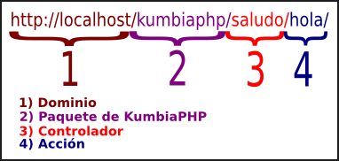
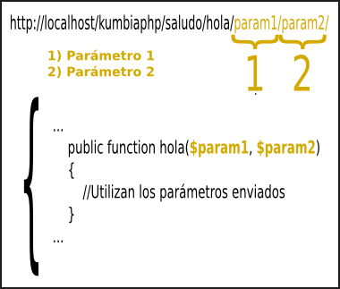

# My first app with KumbiaPHP

After you are ready with the KumbiaPHP installation, you can see the welcome page. Now it is time to create your first Hello World application. The goal is that you understand the basic components of the MVC (Model-View-Controller) architecture.

## Hello KumbiaPHP!

Now write the famous "Hello World!" but with a small change: say "Hello KumbiaPHP!". Thinking about this, we have to remember the MVC model, according to this, KumbiaPHP should accept a request, looking for a controller and in the controller it self looking for an action that serves the request. Then, KumbiaPHP uses that information to find the view associated with the request.

## Controller

Now add content to the controller app/controllers/controller/saludo_controller.php

```php
<?php
/** 
 * Controller Saludo
 */
class SaludoController extends AppController {
    public function hola() {

    }
}
 ```

En el código tenemos la definición de la class *SaludoController*, note que
también esta el sufijo *Controller* al final de la declaración de la clase, esto
la identifica como una clase controladora, y esta hereda (extends) de la
superclase *AppController*, con lo que adquiere las propiedades de una clase
controladora, además existe el método hola().

## La Vista

Para poder ver la salida que envía el controlador, es necesario crear la vista
asociada a la acción. Primero, creamos un directorio con el mismo nombre de
nuestro controlador (en este caso debe llamarse saludo), y dentro de este
estan todas las vistas asociadas a las acciones que necesiten mostrar alguna
información. En nuestro ejemplo llamamos a una acción llamada hola; por lo
tanto, creamos un archivo llamado *app/views/saludo/hola.phtml*. Una vez creado
este archivo, le agregamos un poco de contenido:

```html
  <h1>¡Hola KumbiaPHP!</h1>
```

A continuación se prueba al acceder a la siguiente URL: http://localhost/kumbiaphp/saludo/hola/ y el resultado debe ser como muestra la figura 2.2.

 Figura 2.2: Contenido de la vista hola.phtml

## KumbiaPHP and URLs

Para entender el funcionamiento del framework es importante entender sus URLs, la figura 2.3 muestra una URL típica en KumbiaPHP.

 Figura 2.3: URL en KumbiaPHP

En KumbiaPHP no existen las extensiones .php esto porque en primera instancia hay reescritura de URLs y además cuenta con un front-controller encargado de recibir todas las peticiones (mas adelante se explicara en detalle).

Cualquier otra información pasada por URL es tomada como parámetro de la acción, a propósito de nuestra aplicación como muestra la figura 2.4.

 Figura 2.4: URL con parámetros

Esto es útil para evitar que tener estar enviando parámetros GET de la forma ?var=valor&var2=valor2 (esto es, de la forma tradicional como se viene utilizando PHP), la cual revela información sobre la arquitectura de software que se dispone en el servidor. Además, hacen que nuestra URL se vea mal y fea para SEO.

## Add more content

Agregaremos algo de contenido dinámico a nuestro proyecto, para que no sea tan aburrido. Mostraremos la hora y la fecha, usando la función date() .

Cambiamos un poco el controlador *app/controllers/saludo_controller.php*

```php
<?php
/**
 * Controller Saludo
 */ 
class SaludoController extends AppController {
    /** 
     * metodo para saludar
     */
    public function hola() { 
       $this->fecha = date("Y-m-d H:i");
   }
}
```

KumbiaPHP implementa las variables de instancia lo que significa que todos atributos (públicos) definidos en el controller, pasara automáticamente a la vista, en el código anterior tenemos el atributo $this->fecha este pasara a la vista como una variable llamada $fecha .

En la vista que se creó en la sección 2.1.3.3 y agregamos.

```php
<h1>¡Hola KumbiaPHP!</h1>
<?php echo $fecha ?>
```

Ahora, si volvemos a http://localhost/kumbiaphp/saludo/hola/, obtendremos la hora y fecha del momento en que se haga la petición, como se muestra en la figura 2.5.

 Figura 2.5: Hora y fecha de petición

Para agregarle calidez al asunto, le preguntaremos al usuario su nombre vía parámetro 2.1.3.4, volvemos a editar el controlador *saludo_controller.php*

```php
<?php
/** 
 * Controller Saludo
 */ 
class SaludoController extends AppController
{
    /** 
     * método para saludar
     * @param string $nombre
     */ 
    public function hola($nombre)
   {
       $this->fecha = date("Y-m-d H:i");
       $this->nombre = $nombre;
   }
}
```

Editamos la vista *app/views/saludo/hola.phtml*

```php
<h1>Hola <?php echo $nombre ?> , ¡Que lindo es utilizar KumbiaPHP!
¿cierto?</h1>
<?php echo $fecha ?> 
```

Si ahora entramos a *http://localhost/kumbiaphp/saludo/CaChi/* , nos mostrara en el navegador web el saludo junto con el nombre colocado y la fecha actual, como se muestra en la figura 2.6.

 Figura 2.6: Saludando al usuario

## Repeating history

Ahora vamos otra acción llamada adios() y como su nombre indica haremos el proceso inverso a saludar, es decir despedir a los usuarios.

```php
<?php
/** 
 * Controller Saludo
 */ 
class SaludoController extends AppController {
    /** 
     * método para saludar
     * @param string $nombre
     */ 
    public function hola($nombre) {
       $this->fecha = date("Y-m-d H:i");
       $this->nombre = $nombre;
   }
    /** 
     * método para despedir
     */ 
    public function adios() {

    }
}
```

Agregamos una nueva vista para presentar el contenido de la acción adios() y si recordamos lo que se explicó en la sección 2.1.3.3 deberíamos crear una vista *app/views/saludo/adios.phtml* con el siguiente contenido.

```php
<h1>Ops! se ha ido :( </h1>
<?php echo Html::link('saludo/hola/CaChi/', 'Volver a saludar') ?>
```

Si ingresa al siguiente enlace *http://localhost/kumbiaphp/saludo/adios/* se vera un nuevo texto, y un vinculo a la acción hola(), como se muestra en la figura 2.7.

 Figura 2.7: Vista de adiós al usuario.

Html::link(), es uno de los tantos helper que ofrece KumbiaPHP para facilitar al momento de programar en las vistas. Podríamos escribir el código HTML directamente, colocando *[Volver a Saludar](kumbiaphp/saludo/hola/CaChi/)*, pero esto puede conllevar a un problema, imagine que quisiera cambiar de nombre a su proyecto de kumbiaphp a demo, tendríamos que modificar todos los vínculos, los helpers de KumbiaPHP resuelven estos problemas.

Para escribir el código de nuestro "¡Hola KumbiaPHP!" no necesitamos sino un controlador y una vista. No necesitamos modelos, ya que no estamos trabajando con información de una base de datos ni procesando otro tipo de información más compleja.

Nos ubicamos en el directorio */path/to/kumbiaphp/app/controllers/*. Aquí están nuestros controladores (Para más detalles, lee la documentación sobre el directorio app). Para crear un controlador, es importante tener en cuenta las convenciones de nombre que utiliza el Framework. Llamaremos a nuestro controlador *saludo_controller.php*. Note el sufijo *_controller.php* esto forma parte de la convención de nombres, y hace que KumbiaPHP identifique ese archivo como un controlador.