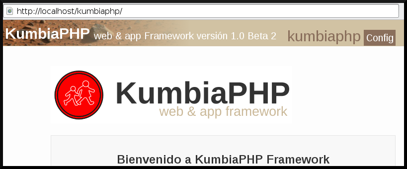

#Instalar KumbiaPHP

En esta sección, se explican los pasos a seguir, para poner a funcionar el
framework en nuestro ambiente de desarrollo.

## Requisitos

Como se mencionó arriba KumbiaPHP es muy fácil y en este sentido los
requerimientos para hacer funcionar el framework son mínimos, a continuación
se listan:

  * Interprete PHP (versión 5.2.2 o superior).
  * Servidor Web con soporte de reescritura de URL (Apache, Nginx, Cherokee, Lighttpd, Internet Information Server (IIS)).
  * Manejador de base de datos soportado por KumbiaPHP.

Para instalar KumbiaPHP Framework, se debe descargar su archivo comprimido
desde la sección de descarga http://www.kumbiaphp.com/blog/manuales-y-descargas/ para
obtener la versión mas reciente del framework. Una vez descargado el archivo,
es esencial asegurarse que tiene la extensión .tgz para usuarios Linux y .zip
para usuarios de Windows, ya que de otro modo no se descomprimirá
correctamente.

A continuación se descomprime su contenido en el directorio raíz del servidor
web (DocumentRoot). Para asegurar cierta uniformidad en el documento, en este
capitulo se supone que se ha descomprimido el paquete del framework en el
directorio kumbiaphp/ . Teniendo una estructura como la siguiente:
```
-- KumbiaPHP-master  
    |-- core  
    |-- default  
        |-- app  
        |-- public  
        |-- .htaccess  
        `-- index.php  
```

## Configurar Apache

KumbiaPHP Framework utiliza un módulo para la reescritura de URLs haciéndolas
mas comprensibles y fáciles de recordar en nuestras aplicaciones. Por esto, el
módulo debe ser configurado e instalado, en este sentido debe chequear que el
módulo esté habilitado, en las siguientes secciones se explica como hacerlo.

### Habilitando mod_rewrite de Apache en GNU/Linux (Debian, Ubuntu y derivados)

Nos aseguramos de activar el mod_rewrite  de esta manera y como usuario
administrador desde la consola.
```bash
  > a2enmod rewrite
  Enabling module rewrite.
  Run '/etc/init.d/apache2 restart' to activate new configuration!
```  
  
Lo anterior indica que se ha habilitado el mod_rewrite  de Apache, pero aun
falta indicarle a Apache que interprete los archivos .htaccess  que son los
encargados de hacer uso del rewrite y a su vez tienen las reglas de
reescritura de las URLs.

Como usuario administrador editamos el siguiente archivo.
``` bash
 > vi /etc/apache2/sites-enabled/000-default  
```
  
```apacheconf
<Directory "/to/document/root">  
    Options Indexes FollowSymLinks
    AllowOverride None
    Order allow,deny
    Allow from all
</Directory>  
```
  
Para que los .htaccess tengan efectos, se ha de sustituir
*AllowOverride None*
por *AllowOverride All*, de esta manera Apache puede interpretar estos archivos.

Hecho esto, queda reiniciar el servicio de apache.

```bash
 >/etc/init.d/apache2 restart  
```

A continuación, se prueba todas las configuraciones realizadas mediante la
siguiente URL.

http://localhost/kumbiaphp/  

  
Si todo ha ido bien, debería ver una página de bienvenida como la que se
muestra en la figura 2.1, con lo que la instalación rápida se puede dar por
concluida.



Figura 2.1: Instalación exitosa de KumbiaPHP

Esto es un entorno de pruebas el cual esta pensado para practicar con
KumbiaPHP en un servidor local, no para desarrollar aplicaciones complejas que
terminan siendo publicadas en la web.

## Configurar Nginx


### ¿Por qué es importante el Mod-Rewrite?

ReWrite es un módulo de apache que permite reescribir las urls que han
utilizado nuestros usuarios. KumbiaPHP Framework encapsula esta complejidad
permitiendo usar URLs bonitas o limpias como las que vemos en blogs o en
muchos sitios donde no aparecen los ?, los & ni las extensiones del servidor
(.php, .asp, .aspx, etc).

Además de esto, con mod-rewrite KumbiaPHP puede proteger nuestras
aplicaciones ante la posibilidad de que los usuarios puedan ver los
directorios del proyecto y puedan acceder a archivos de clases, modelos,
lógica, etc., sin que sean autorizados.

Con mod-rewrite  el único directorio que pueden ver los usuarios es el
contenido del directorio público (public) del servidor web, el resto permanece
oculto y solo puede ser visualizado cuando ha realizado una petición en forma
correcta y también es correcto según nuestra lógica de aplicación. Cuando
escribes direcciones utilizando este tipo de URLs, estas ayudando también a
los motores de búsqueda a indexar mejor tu información.

